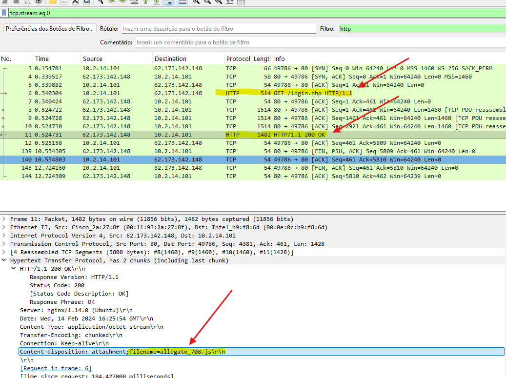
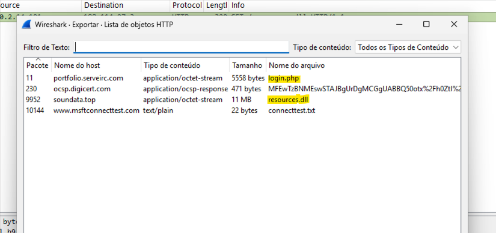
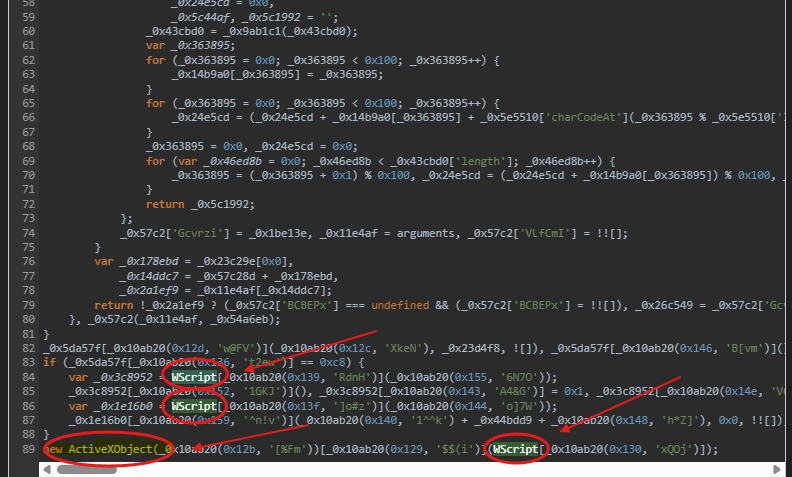
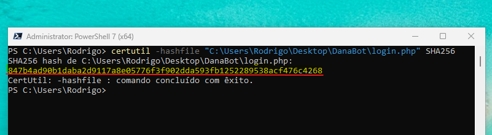
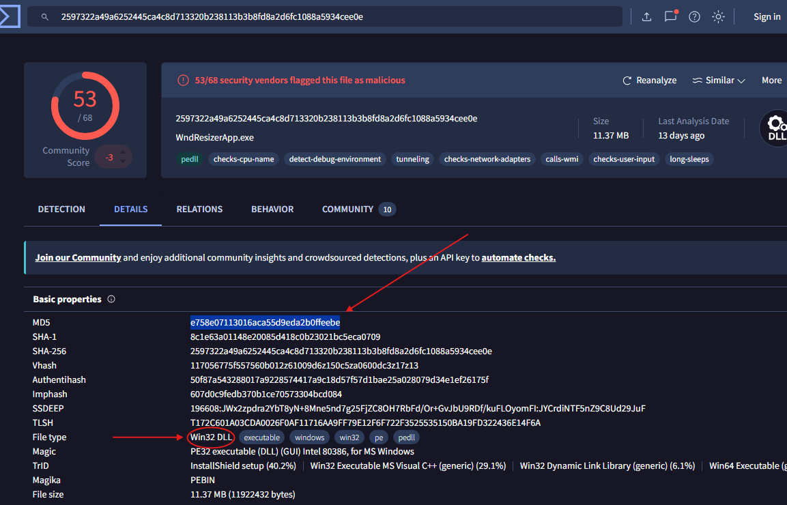

# DanaBot - Malware Traffic Analysis & IOC Extraction

## Introduction

This lab focused on analyzing malicious network traffic associated with the DanaBot malware.  
The objective was to investigate the infection chain, identify malicious payloads, analyze obfuscated JavaScript, and extract Indicators of Compromise (IOCs).

---

# Objective

- Analyze network traffic using Wireshark
- Identify malicious HTTP communications
- Extract malicious files
- Analyze obfuscated JavaScript
- Identify Windows native execution components
- Extract hashes and Indicators of Compromise (IOCs)

---

# Scenario

A `.pcap` file containing suspicious network traffic was provided for analysis.  
The investigation involved identifying malicious communications, extracting transferred files, analyzing payloads, and determining how the malware executed on the victim machine.

---

# Tools Used

| Tool | Purpose |
|---|---|
| Wireshark | Network traffic analysis |
| PowerShell | Hash extraction |
| Certutil | SHA256 generation |
| VirusTotal | Malware reputation analysis |
| JavaScript Deobfuscator | Script analysis |

---

# Initial Traffic Analysis

The investigation started by analyzing the `.pcap` file using Wireshark.

A suspicious TCP connection was identified between the internal host `10.2.14.101` and the external IP address `62.173.142.148`.

After the TCP three-way handshake (`SYN → SYN,ACK → ACK`), an HTTP response containing a malicious JavaScript payload was observed.

The payload was delivered as:

```http
Content-Disposition: attachment; filename=allegato_708.js
```

This indicated that the server delivered a potentially malicious JavaScript file to the victim machine.



---

# HTTP Object Extraction

Using the Wireshark feature:

```text
File → Export Objects → HTTP
```

Multiple transferred files were extracted from the captured traffic.

The following objects were identified:

- `login.php`
- `resources.dll`
- `connecttest.txt`

The `.dll` file immediately appeared suspicious because DLL files can contain executable malicious payloads.



---

# JavaScript Analysis & Deobfuscation

The file `allegato_708.js` was heavily obfuscated.

After deobfuscating the script, references to:

- `WScript`
- `ActiveXObject`

were identified.



---

# Understanding WScript & ActiveXObject

## WScript

`WScript` refers to the Windows Script Host (`wscript.exe`), a legitimate Windows component capable of executing `.js` and `.vbs` scripts.

Malware commonly abuses this native Windows binary to execute malicious scripts while appearing legitimate.

## ActiveXObject

`ActiveXObject` allows JavaScript to interact directly with Windows COM objects.

This enables malware to:
- download files
- execute commands
- interact with the operating system
- automate malicious actions

---

# SHA256 Hash Extraction

The SHA256 hash of the extracted malicious file was generated using the following command:

```powershell
certutil -hashfile "login.php" SHA256
```

The resulting hash was successfully extracted for IOC analysis.



---

# DLL Malware Analysis

The extracted `resources.dll` file was analyzed using VirusTotal.

The file was identified as:

- Win32 DLL
- malicious executable
- detected by multiple antivirus engines



---

# Understanding DLL Files

DLL stands for:

```text
Dynamic Link Library
```

DLL files are Windows executable libraries that contain reusable code and functions.

Malware frequently abuses DLL files because they:
- can execute malicious payloads
- help evade detection
- can be loaded by legitimate processes
- are common within Windows environments

---

# Indicators of Compromise (IOCs)

| Type | Value |
|---|---|
| IP Address | 62.173.142.148 |
| Malicious JavaScript | allegato_708.js |
| DLL Payload | resources.dll |
| Process | wscript.exe |
| SHA256 | 84f7b4ad90b1daba2d9117a8e05776f3f902dda593fb1252289538acf476c4268 |
| MD5 | e758e07113016aca55d9eda2b0ffeebe |

---

# MITRE ATT&CK Techniques

| Technique | ID |
|---|---|
| Command and Scripting Interpreter: JavaScript | T1059.007 |
| Ingress Tool Transfer | T1105 |
| User Execution | T1204 |
| DLL Side-Loading / Execution | T1574 |

---

# Attack Flow

1. A TCP connection was established with the external IP `62.173.142.148`
2. HTTP communication was initiated
3. A malicious JavaScript payload (`allegato_708.js`) was delivered
4. The script executed through `wscript.exe`
5. Additional payloads were downloaded
6. A malicious DLL (`resources.dll`) was identified
7. IOC’s and hashes were extracted for threat intelligence analysis

---

# Key Learnings

- TCP handshake analysis
- HTTP traffic investigation
- Malicious payload identification
- Wireshark object extraction
- JavaScript deobfuscation
- Windows Script Host abuse
- IOC extraction
- SHA256 and MD5 hash analysis
- Malware investigation workflow

---

# Conclusion

This laboratory provided practical experience in malware traffic analysis and incident investigation using DFIR methodologies.

Through the analysis of network traffic, malicious scripts, DLL payloads, and IOC extraction, it was possible to understand part of the infection chain associated with DanaBot malware activity.

The lab also reinforced concepts related to:
- network forensics
- malware analysis
- threat intelligence
- Windows internals
- malicious script execution
