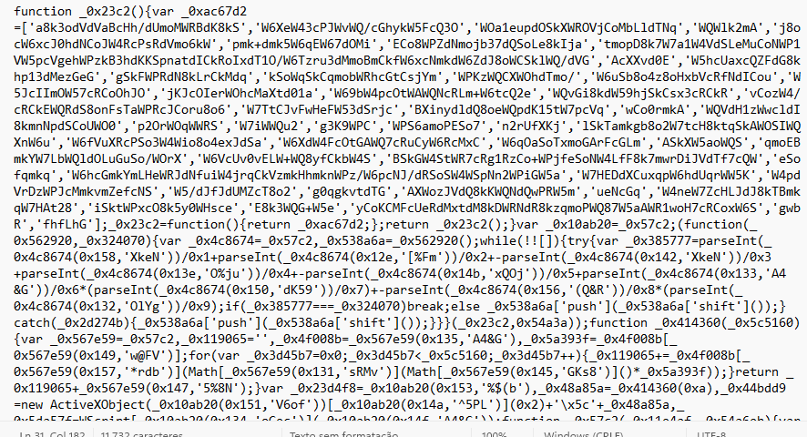

# DanaBot - Malware Traffic Analysis & IOC Extraction

## Introduction

This lab focused on analyzing malicious network traffic associated with the DanaBot malware.  
The objective was to investigate the infection chain, identify malicious payloads, analyze obfuscated JavaScript, and extract Indicators of Compromise (IOCs).

---

# Objective

- Analyze network traffic using Wireshark
- Identify malicious HTTP communications
- Extract malicious files
- Analyze obfuscated JavaScript
- Identify Windows native execution components
- Extract hashes and Indicators of Compromise (IOCs)

---

# Scenario

A `.pcap` file containing suspicious network traffic was provided for analysis.  
The investigation involved identifying malicious communications, extracting transferred files, analyzing payloads, and determining how the malware executed on the victim machine.

---

# Tools Used

| Tool                    | Purpose                      |
|-------------------------|------------------------------|
| Wireshark               | Network traffic analysis     |
| PowerShell              | Hash extraction              |
| Certutil                | SHA256/MD5 generation        |
| VirusTotal              | Malware reputation analysis  |
| JavaScript Deobfuscator | Script analysis              |

---

# Initial Traffic Analysis

The investigation started by analyzing the `.pcap` file using Wireshark.

A suspicious TCP connection was identified between the internal host `10.2.14.101` and the external IP address `62.173.142.148`.

After the TCP three-way handshake (`SYN → SYN,ACK → ACK`), an HTTP response containing a malicious JavaScript payload was observed.

The payload was delivered via the URI `http://portfolio.serveirc.com/login.php` with the following header:

```http
Content-Disposition: attachment; filename=allegato_708.js
```

> **Note:** The name *allegato* means "attachment" in Italian, which may indicate the geographic targeting or origin of this campaign.

This indicated that the server delivered a malicious JavaScript file disguised as a routine HTTP response to the victim machine.


---

# HTTP Object Extraction

Using the Wireshark feature:

```
File → Export Objects → HTTP
```

Multiple transferred files were extracted from the captured traffic.

The following objects were identified:

- `login.php` — delivery endpoint containing the malicious JavaScript payload (`allegato_708.js`)
- `resources.dll` — secondary payload downloaded from `http://soundata.top/resources.dll`
- `connecttest.txt` — likely used for connectivity verification

The `.dll` file immediately appeared suspicious because DLL files can contain executable malicious payloads.

> **Key observation:** Two distinct domains were used during the attack — `portfolio.serveirc.com` for JavaScript delivery and `soundata.top` for DLL payload delivery. This separation is a common technique to avoid single-domain blocking by security controls.


---

# Obfuscated JavaScript Analysis

## File Identification

The file `allegato_708.js` was delivered inside the HTTP response of `login.php`. The Content-Type header `application/octet-stream` confirmed a binary/file download rather than a standard web page.

## Obfuscation Techniques Observed

Before deobfuscation, the script presented highly obfuscated code using techniques commonly found in malware samples:

- Randomized variable names (e.g., `_0x23c2`, `_0xac67d2`)
- Hexadecimal-encoded values
- Indirect function calls through lookup arrays
- RC4-based string encryption with Base64 encoding
- Unreadable logic structures designed to evade static analysis

These techniques serve to:
- Hide malicious behavior from analysts
- Evade antivirus signature detection
- Complicate reverse engineering
- Make forensic analysis more time-consuming



## Deobfuscation & Behavior Analysis

After deobfuscation, the following behavior was reconstructed:

**1. HTTP Request to C2**  
The script uses `WScript` to create an HTTP object and sends a `GET` request to the attacker's server. It then checks if the HTTP response status equals `0xc8` (decimal `200`), confirming a successful download before proceeding.

**2. Payload Storage**  
Using `ActiveXObject`, the script creates a `Stream` object, writes the downloaded binary content to disk, and saves it under a randomly generated 10-character filename in a temporary directory path.

**3. DLL Execution**  
After saving the file, the script uses `WScript.Shell` to execute the dropped DLL payload via `rundll32.exe` or a similar Windows-native execution method.

Key identifiers found in the deobfuscated script:

- `WScript` — Windows Script Host used for HTTP requests and shell execution
- `ActiveXObject` — COM object interface used for file I/O and network operations
- Status code check `0xc8 = 200` — confirms successful C2 communication before payload execution
- Random filename generation — used to avoid static filename-based detection


---

# Understanding WScript & ActiveXObject

## WScript

`WScript` refers to the Windows Script Host (`wscript.exe`), a legitimate Windows component capable of executing `.js` and `.vbs` scripts natively.

Malware commonly abuses this native Windows binary — a technique known as **Living off the Land (LotL)** — to execute malicious scripts while blending in with normal system activity.

## ActiveXObject

`ActiveXObject` allows JavaScript to interact directly with Windows COM objects.

This enables malware to:
- Download files from remote servers
- Execute system commands
- Interact with the file system
- Automate malicious actions without external dependencies

---

# SHA256 Hash Extraction

The SHA256 hash of the malicious JavaScript payload (`allegato_708.js`, delivered as `login.php`) was extracted using:

```powershell
certutil -hashfile "login.php" SHA256
```

> **Note:** The exported file is named `login.php` because that was the HTTP endpoint, but its content is the JavaScript payload `allegato_708.js` as identified by the `Content-Disposition` header.


---

# DLL Payload Analysis

The extracted `resources.dll` was downloaded from `http://soundata.top/resources.dll` as a secondary stage payload.

The file was analyzed using VirusTotal and identified as:

- Win32 DLL
- Malicious executable
- Detected by multiple antivirus engines as DanaBot


## Understanding DLL Abuse in Malware

DLL (Dynamic Link Library) files are Windows executable libraries containing reusable code and functions.

Malware frequently abuses DLL files because they:
- Can execute malicious payloads when loaded by a host process
- Help evade detection by blending with legitimate system libraries
- Can be loaded by trusted Windows processes (e.g., `rundll32.exe`)
- Are common and expected within Windows environments

---

# Indicators of Compromise (IOCs)

| Type                   | Value                                                              |
|------------------------|--------------------------------------------------------------------|
| IP Address (C2)        | 62.173.142.148                                                     |
| Domain (JS Delivery)   | portfolio.serveirc.com                                             |
| Domain (DLL Delivery)  | soundata.top                                                       |
| Malicious JavaScript   | allegato_708.js                                                    |
| JS Delivery URL        | http://portfolio.serveirc.com/login.php                            |
| DLL Download URL       | http://soundata.top/resources.dll                                  |
| DLL Payload            | resources.dll                                                      |
| Process Abused         | wscript.exe                                                        |
| SHA256 (JS Payload)    | 84f7b4ad90b1daba2d9117a8e05776f3f902dda593fb1252289538acf476c4268 |
| MD5 (JS Payload)       | e758e07113016aca55d9eda2b0ffeebe                                   |

---

# MITRE ATT&CK Techniques

| Technique                                          | ID        | Observed Behavior                                      |
|----------------------------------------------------|-----------|--------------------------------------------------------|
| Command and Scripting Interpreter: JavaScript      | T1059.007 | Malicious JS executed via wscript.exe                  |
| Ingress Tool Transfer                              | T1105     | resources.dll downloaded from soundata.top             |
| User Execution                                     | T1204     | User interaction triggered JS execution                |
| DLL Side-Loading / Execution                       | T1574     | Malicious DLL loaded for payload execution             |
| Living off the Land — Signed Binary Proxy Execution| T1218     | wscript.exe used to execute malicious script natively  |

---

# Attack Flow

```
Victim machine (10.2.14.101)
        |
        | TCP SYN → 62.173.142.148
        |
        ↓
HTTP GET http://portfolio.serveirc.com/login.php
        |
        | Response: allegato_708.js (Content-Type: application/octet-stream)
        |
        ↓
wscript.exe executes allegato_708.js
        |
        | Status check: HTTP 200 (0xC8) confirmed
        |
        ↓
HTTP GET http://soundata.top/resources.dll
        |
        | resources.dll saved to disk with random filename
        |
        ↓
DLL executed → DanaBot active on victim machine
```

---

# Key Learnings

- TCP handshake identification and connection tracking in Wireshark
- HTTP traffic investigation using filters and stream following
- Malicious payload identification via `Content-Disposition` headers
- Wireshark HTTP object extraction
- JavaScript obfuscation techniques (RC4 + Base64, array-based string lookup)
- JavaScript deobfuscation and behavior reconstruction
- Windows Script Host (`wscript.exe`) abuse — Living off the Land technique
- Two-stage infrastructure: separate domains for JS delivery and DLL delivery
- IOC extraction and mapping to threat intelligence
- SHA256 and MD5 hash analysis
- MITRE ATT&CK technique mapping

---

# Conclusion

This laboratory provided practical experience in malware traffic analysis and incident investigation using DFIR methodologies.

Through the analysis of network traffic, malicious scripts, DLL payloads, and IOC extraction, it was possible to reconstruct the full infection chain associated with DanaBot malware activity — from initial JavaScript delivery through to secondary payload execution.

The lab reinforced concepts related to:
- Network forensics and traffic analysis
- Malware delivery chain investigation
- JavaScript obfuscation and deobfuscation
- Threat intelligence and IOC extraction
- Windows internals and Living off the Land techniques
- MITRE ATT&CK framework mapping
